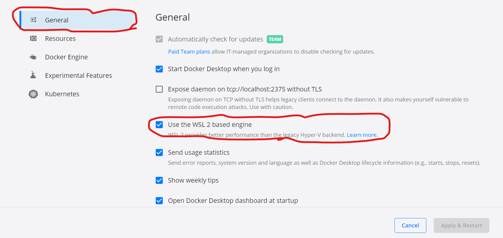
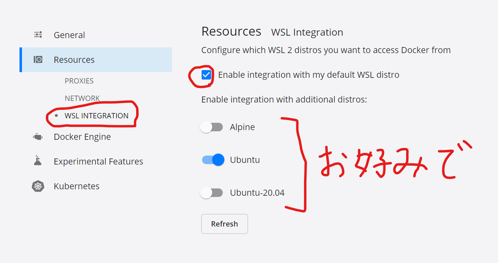

= WSL2上でDockerを使うときに少し楽になる方法

== 背景
WSL2 上で直接``sudo apt install docker-ce docker-engine``などでインストールしても、 +
WSL2の制約で、WSL2のディストロ起動時にdocker デーモンが起動してくれない。 +
WSL2ディストロ起動時に毎回``sudo service docker start``を実行しないといけないので面倒。

== 解決策

ざっくりいうと、以下の2ステップ

. Docker for Desktop をインストール
. Docker for Desktop でWSL2統合機能を有効化する

=== Docker for Desktop をインストール

https://docs.docker.com/docker-for-windows/wsl/[公式サイト]の記述が詳しいと思うので省略。 +
↑にリンクだけ貼っておく。

=== Docker for Desktop でWSL2統合機能を有効化する

以下、スクショ中に赤枠で示して説明する。

. Docker for Desktopの設定ボタンをクリック
+ 

. "Use the WSL2 based engine"にチェック
+

. WSL 統合機能の有効化
+

== 結果

* これをすることで``sudo service docker start``せずともdockerが使えるようになる(``docker image ls``コマンドにて確認)
* [副産物]WSL2の全ディストロでdockerの状態が共有されるようになる(確認したのは、``docker image ls``、``docker ps``の出力が各ディストロで同じものになる)。 +
各ディストロで同じimage作らなくて良くなるのが良い。 +
その分、合計の容量も削減されるのだろうか？要調査。
* mobyが使えなくなる。 +
まあ、mobyインストールしただけだと<<how_to_install_moby.doc#先にDocker公式ページに従ってインストールする理由, 先にDocker公式ページに従ってインストールする理由>>にも書いた通り、 +
``service``コマンドを使ってdockerデーモンが起動できないこともあって、moby使うのは何かいろいろ面倒そうなので、 +
これからはDocker for Desktopに依存して楽をしていくことにする。